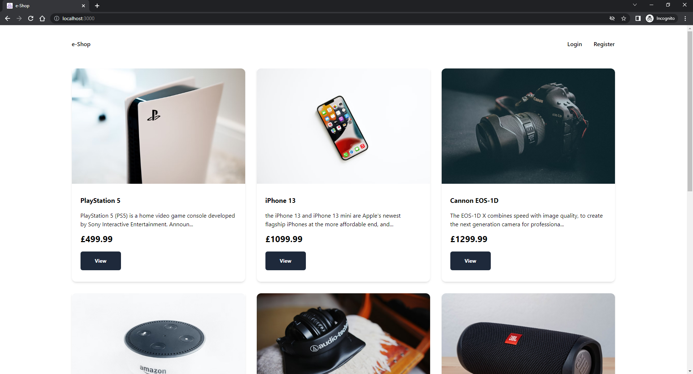
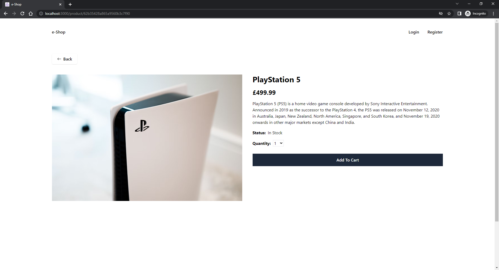
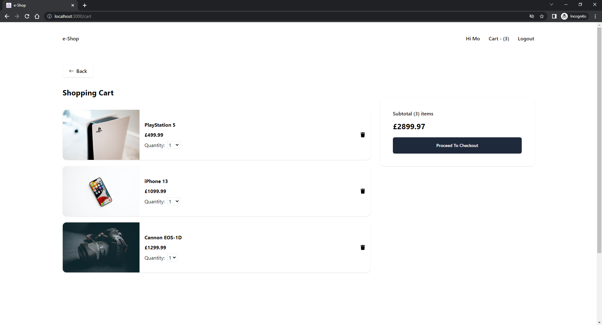
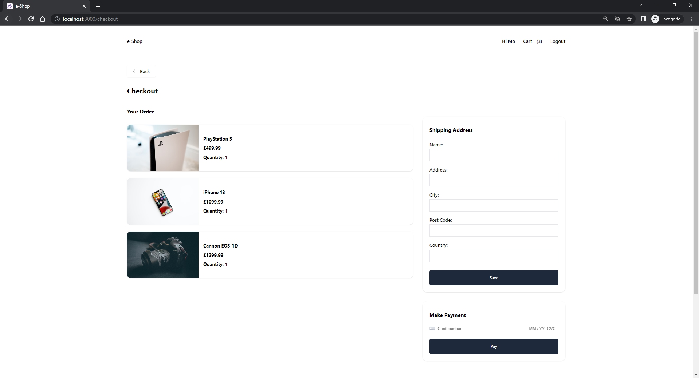

# e-Shop

An eCommerce site built using the MERN Stack. - [View](https://e-shop-mocodes.herokuapp.com/)

Users can:

- View the products listing page
- Add products to the cart
- Select product quantity
- View the cart page
- Delete items from the cart
- Create an account or login (Credentials stored in MongoDB)
- Make a payment (Stripe Test Payment)

## Table of contents

- [Screenshots](#screenshots)
- [Technologies](#technologies)
- [Languages](#languages)
- [Contact](#contact)

## Screenshots

## Technologies

- React
- React Hooks, React Router, React Testing Library
- Redux
- Stripe
- Axios
- MongoDB
- Node.js and NPM
- Express
- Tailwind
- Postman
- Git & GitHub
- Visual Studio Code (IDE)

## Languages

- JavaScript

## Contact

Coded by Mo - [mocodes](https://mocodes.co.uk/)

Twitter: [@mocodes\_](https://twitter.com/mocodes_)
